# Auth Migration Plan: localStorage Bearer Token → httpOnly Cookie

> Status: PLANNED (not yet executed)
> Feature owner: `src/features/auth`
> Related infra: `src/shared/lib/api.ts`, `src/shared/lib/echo.ts`, `next.config.ts`, `src/middleware.ts` (new)

---

## 1. Goals & Non-Goals

### Goals
- **G1 — XSS hardening:** the raw API token must never be readable by client-side JavaScript (today it lives in `localStorage`, exposed to any XSS payload).
- **G2 — Single source of truth:** eliminate the duplicated token storage (zustand `auth-store` key **and** standalone `auth_token` key).
- **G3 — Zero consumer churn:** cart, wishlist, checkout, notifications, coupons, profile, etc. must not need edits (they all go through `apiFetch`).
- **G4 — Keep UX parity:** login / register / OTP / forgot-password / Google social login / logout / 401 handling all keep working, including cross-tab behavior and session expiry.
- **G5 — Refresh-safe sessions:** on hard refresh the session is restored from the httpOnly cookie (no token in `localStorage` needed).

### Non-Goals
- Changing the backend API (verified below: it cannot set cookies or accept cookie auth).
- Token refresh/rotation (API has no refresh endpoint; expiry-based invalidation stays).
- SSR-authenticated rendering (becomes *possible* after migration; an optional follow-up).
- Replacing the review cleanup items (public-surface exports, ApiError dedupe, dead code removal) — tracked at the end.

---

## 2. Verified API Facts (curl evidence, 2026-09-24)

| Test | Request | Result |
|---|---|---|
| F1 | `POST /token` (`email`+`password`) | `200` — token in JSON body, **no `Set-Cookie`**. Token is a Laravel Sanctum PAT (`48|…`), with `expires_at` (ISO, ~20 days) and rate limit `5/min` |
| F2 | `GET /me` + `Authorization: Bearer <token>` | `200` — Bearer works |
| F3 | `GET /me` + `Cookie: auth_token=<token>` | `401 Unauthenticated` — **API rejects cookie auth** |
| F4 | CORS headers on API | `Access-Control-Allow-Origin: *`, **no** `Access-Control-Allow-Credentials` — browser will never attach cookies cross-site |

**Conclusion:** the httpOnly cookie must live on the **Next.js origin**. Next.js proxies API calls and translates the cookie into a Bearer header per request (the API is untouched). This repo runs **Next 16.2.6**, so the bridge file uses the Next 16 convention **`src/proxy.ts`** (exported `proxy` function — `middleware.ts` is renamed/deprecated in Next 16).

Environment facts:
- API base: `https://catch.mohammedtareq.me/api/v1` (`.env` `NEXT_PUBLIC_API_URL`)
- Site origin: `https://catch.mohammedtareq.me` — same host as the API in production, but the proxy design works regardless (also in `next dev` on `localhost:3000`).
- Realtime: Laravel Echo/Pusher auth endpoint is `${API_URL}/broadcasting/auth` with `Authorization` header from localStorage (`src/shared/lib/echo.ts:95-112`) — a hidden 5th token consumer.

### The 5 places the token is read today
1. `src/shared/lib/api.ts:28-31` — `getAuthToken()` → `Authorization` header for **every** API call; also clears the key on 401 (`api.ts:219-226`).
2. `src/features/auth/store/useAuthStore.ts:36-45` — `writeTokenToStorage()` writes/clears `auth_token`.
3. `src/features/auth/store/useAuthStore.ts:166-202` — zustand `persist` writes `token` **again** inside the `auth-store` key (duplicate source of truth).
4. `src/shared/lib/echo.ts:101,112` — Pusher auth header read directly from localStorage.
5. `src/features/auth/hooks/useAuthExpirationCheck.ts:49-53` — cross-tab logout detection via `storage` events on `auth_token`.

---

## 3. BEFORE — Current Architecture

### 3.1 Storage model

```
┌─────────────────────────── Browser storage ───────────────────────────┐
│                                                                        │
│  localStorage                                                          │
│  ├── "auth_token"      ← raw Sanctum token (written by writeTokenTo…)  │
│  │                        read by api.ts for Authorization header      │
│  │                        read by echo.ts for Pusher auth header       │
│  │                                                                     │
│  └── "auth-store"      ← zustand persist (PARTIALIZED state):          │
│                             token (DUPLICATE!), id, permissions, role, │
│                             emailVerified, isAuthenticated, email,     │
│                             phoneNumber, name, image, userId,          │
│                             expiresAt                                  │
│                                                                        │
│  Token exists in TWO places. Neither is httpOnly. Any XSS = token stolen.│
└────────────────────────────────────────────────────────────────────────┘
```

### 3.2 Authenticated request flow (before)

```mermaid
flowchart LR
    subgraph Browser["Browser (JS)"]
        C["Client code<br/>(cart / wishlist / checkout / …)"]
        LS["localStorage<br/>auth_token (RAW TOKEN — readable by JS)"]
        AF["apiFetch<br/>shared/lib/api.ts"]
    end
    C -->|"reads token from<br/>localStorage"| LS
    LS --> AF
    AF -->|"Authorization: Bearer 48&#124;…<br/>cross-origin fetch"| API["Laravel API<br/>catch.mohammedtareq.me/api/v1"]
    API -->|"JSON, ACAO: *<br/>(no credentials)"| AF
    AF -->|"401 → remove auth_token<br/>+ notifyUnauthorized()"| LS
```

### 3.3 Login flow (before)

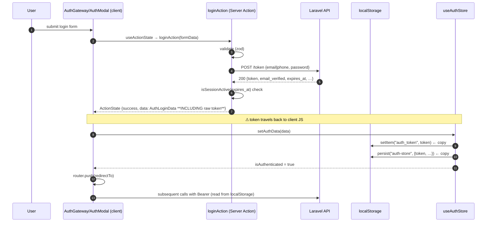

**Security notes (before):**
- The token round-trips through the client JS and ActionState; anything XSS can read both storage keys and replay the token.
- `loginAction` also returns the submitted **password** back inside `payload` (`actions/login.ts:26`).
- Logout requires client JS to have the token (server call) *and* to clear two storage keys.

### 3.4 Social (Google) login flow (before)

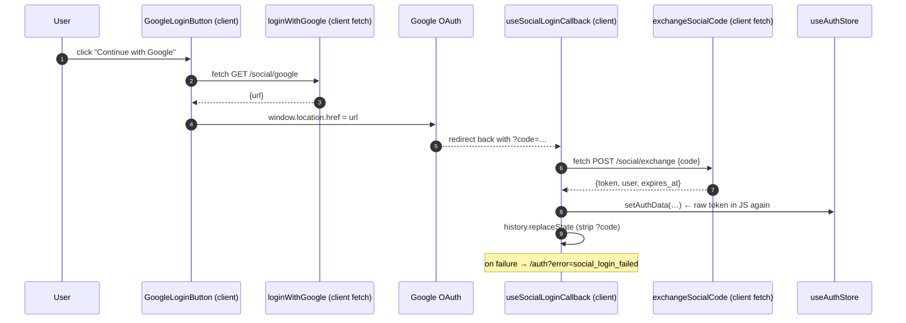

### 3.5 Session restore on refresh (before)

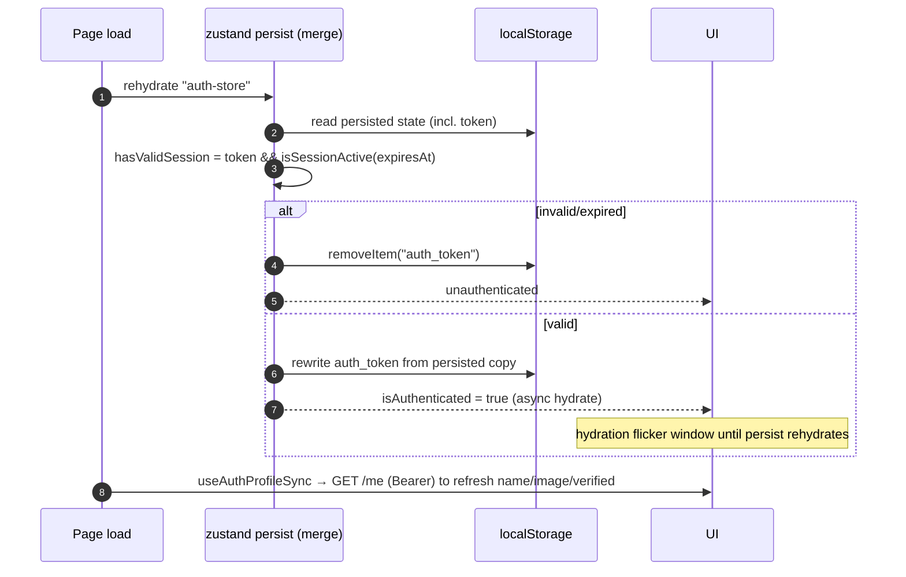

### 3.6 401 / unauthorized handling (before)

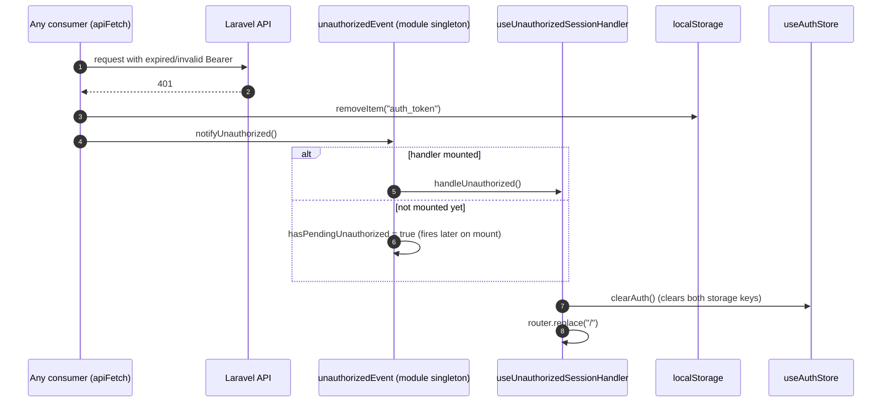

Cross-tab logout additionally relies on the `storage` event on `auth_token` (`useAuthExpirationCheck.ts:49-53`).

### 3.7 Known defects found during review (to fix in/along migration)

| # | Defect | Location |
|---|---|---|
| D1 | Public surface `features/auth/index.ts` exports only 6 items; 30+ deep imports across 9 features (`@/features/auth/store/useAuthStore`, `services/authService`, `components/*`) | `src/features/**` |
| D2 | Auth ↔ Profile circular dependency: auth imports `profileService` (`useAuthProfileSync.ts:5`) while profile imports `useAuthStore` + `authService` | `src/features/auth/hooks/useAuthProfileSync.ts:5`, `src/features/profile/**` |
| D3 | Token duplicated in two storage keys | `useAuthStore.ts:36-45,166-202`, `api.ts:28-31` |
| D4 | No token refresh — expiry logout only | `useAuthExpirationCheck.ts` |
| D5 | `loginAction` returns **password** back to client in `payload` | `actions/login.ts:26` |
| D6 | Unsafe casts: `...(response.user as Record<string, unknown>)` spread into `AuthLoginData`; `parsedBody as T` in apiFetch | `useSocialLoginCallback.ts:34`, `api.ts:216` |
| D7 | Duplicate service methods hitting the same endpoint (`forgetPassword` vs `verifyForgetPasswordToken`) | `authService.ts:96-117` |
| D8 | Dead code: store `login`/`register` (actions call `authService` directly, and without `lang`), `types.ts.bak` | `useAuthStore.ts:108-153`, `types.ts.bak` |
| D9 | ApiError → fieldErrors mapping copy-pasted 4× in actions; hardcoded English strings bypass `messages/auth.*.json` | `actions/login.ts:51-63`, `register.ts:60-74`, `otp.ts:48-59` |
| D10 | OTP resend fired fire-and-forget (no pending/error state) | `AuthGateway.tsx:57-67` |
| D11 | Expiry logout redirects to `/`, losing current page + `?redirect=` param | `useAuthExpirationCheck.ts:28` |
| D12 | Inline regex validation in forgotPassword while siblings use zod | `actions/forgotPassword.ts:25,41` |

---

## 4. AFTER — Target Architecture

### 4.1 Concept

```
┌───────────────────────────────────── Browser ─────────────────────────────────────┐
│                                                                                   │
│  Cookies (host: site origin)                                                      │
│  ├── mm_session  httpOnly=true, secure=true, sameSite=lax, path=/                 │
│  │                value = raw Sanctum token — **NOT readable by JS**              │
│  │                                                                               │
│  └── "auth-store" (zustand persist) — NON-SENSITIVE session metadata only:        │
│        isAuthenticated, expiresAt, emailVerified, email, phoneNumber,             │
│        name, image, userId, id, permissions, role   (NO token field)              │
│                                                                                   │
│  JS cannot read the token. XSS cannot steal it. Nothing to sync twice.            │
└───────────────────────────────────────────────────────────────────────────────────┘

Client API calls go to SAME-ORIGIN /api/v1/* and are proxied server-side:

  Browser ──(cookie auto-attached, same-origin)──▶ Next.js server
                                                    ├── middleware: mm_session → Authorization: Bearer
                                                    └── rewrite → Laravel API (upstream Bearer call)
```

### 4.2 Components to build

| Component | Location | Responsibility |
|---|---|---|
| **Proxy rewrite** | `next.config.ts` | `rewrites(): [{ source: "/api/v1/:path*", destination: \`${API_URL}/:path*\` }]` using a **server-only** env var (`API_URL`, falling back to `NEXT_PUBLIC_API_URL` during migration) |
| **Token bridge proxy** | `src/proxy.ts` (**Next 16 convention**; existed at HEAD as the **next-intl locale-routing middleware** — the initial migration incorrectly claimed "no existing middleware in repo" and replaced it; restored and unified in the same file) | Three ordered branches: (1) matcher `/api/v1/*` → read `mm_session` cookie → set `Authorization: Bearer <token>` request header via `NextResponse.next({ request: { headers } })`; never log the token; never override an existing `Authorization` header; (2) locale-prefixed page guards by cookie presence (auth inverse-gate honoring validated `?redirect=`; protected-route gate with unprefixed `redirect` param); (3) fall-through to `intlMiddleware` for locale routing (`/` → default locale, unprefixed → prefixed, `NEXT_LOCALE` cookie). Static/`_next`/`_vercel`/`trpc`/file-like paths bypass everything |
| **Session cookie helpers** | `src/features/auth/session/sessionCookies.ts` (server-only) | `setSessionCookie(token, expiresAt)`, `clearSessionCookie()`, `readSessionToken()` — wrap `next/headers` `cookies()`; cookie names from `src/shared/constants/sessionCookies.ts`; `mm_session` is `httpOnly, secure: prod, sameSite: "lax", path: "/", expires: parsed expires_at`; a JS-readable companion hint cookie `mm_session_hint` (value `1`, no secret) is set/cleared alongside so client `apiFetch` can detect a session (JS cannot read httpOnly cookies) |
| **Session cookie helpers** | `src/features/auth/session/sessionCookies.ts` (server-only) | `setSessionCookie(token, expiresAt)`, `clearSessionCookie()`, `readSessionToken()` — wrap `next/headers` `cookies()`; cookie name `mm_session`; `httpOnly, secure: prod, sameSite: "lax", path: "/", expires: parsed expires_at` |
| **Session snapshot action** | `src/features/auth/actions/session.ts` (new) | `getSessionAction(): Promise<SessionSnapshot \| null>` — reads cookie; if present returns `{ isAuthenticated: true, expiresAt, emailVerified, name, image, email, phoneNumber, id }` (optionally hydrated from `GET /me`); called once by `AuthSyncHandler` on mount to hydrate the store |
| **Server actions (migrated)** | `actions/login.ts`, `register.ts`, `otp.ts`, `forgotPassword.ts` | On success: `setSessionCookie(...)` and return `SessionSnapshot` (NO token, NO password) in `ActionState.data` |
| **Social exchange action** | `actions/socialExchange.ts` (new) | Server action wrapping `exchangeSocialCode` (moves the last direct client `fetch` off the client); sets cookie; returns snapshot |
| **Store (reworked)** | `store/useAuthStore.ts` | Token-less: `token` field, `writeTokenToStorage`, and `getAuthToken`-style reads **deleted**; `setAuthData(snapshot)` validates `expiresAt` only; logout triggers a server action that clears the cookie |
| **apiFetch (reworked)** | `shared/lib/api.ts` | Client base path = `/api/v1` (same-origin); **delete** `getAuthToken()`, `AUTH_TOKEN_STORAGE_KEY` import, localStorage clearing on 401 (cookie clearing is server-side); keep 401 → `notifyUnauthorized()` |
| **Echo/Pusher (reworked)** | `shared/lib/echo.ts` | `authEndpoint = "/api/v1/broadcasting/auth"` (same-origin → cookie attaches); remove `Authorization` header + `hasToken` localStorage read |
| **Expiry check** | `hooks/useAuthExpirationCheck.ts` | Unchanged logic on `expiresAt`; cross-tab sync switches from `storage` on `auth_token` → `storage` on `auth-store` (fires when any tab writes persist state) |

### 4.3 Authenticated request flow (after)

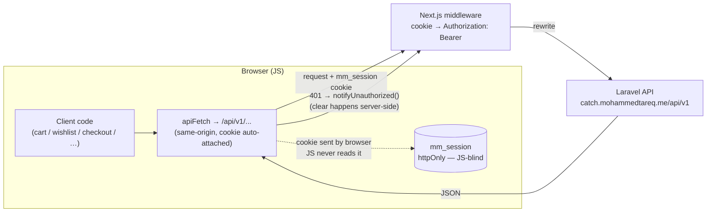

### 4.4 Login flow (after)

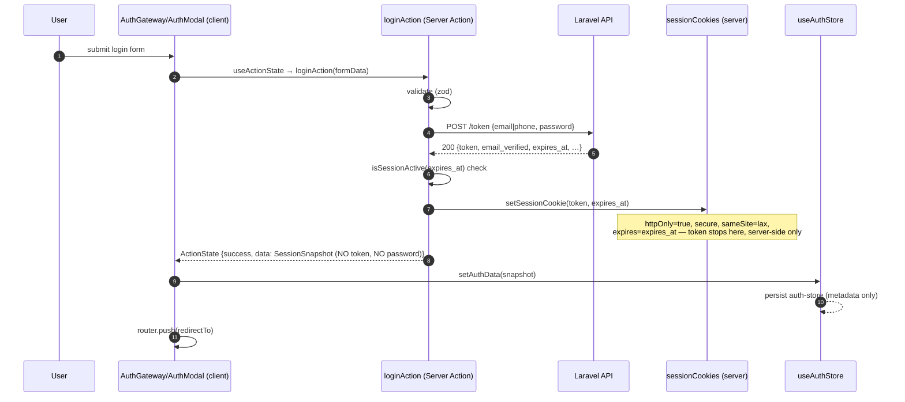

**Security notes (after):**
- The token never enters client JS or React state; `ActionState.data` carries only user metadata + `expiresAt`.
- Password no longer returned in `payload` (D5 fixed in this pass).
- Cookie attributes: `httpOnly=true` (JS-blind), `secure=true` in prod, `sameSite="lax"` (top-level navigation sends it; cross-site POSTs don't), `path=/` (covers the proxied `/api/v1` path).
- CSRF posture: server actions have built-in origin checks; proxied API calls are same-origin GET/POST with SameSite=Lax cookies.

### 4.5 Register + OTP flow (after)

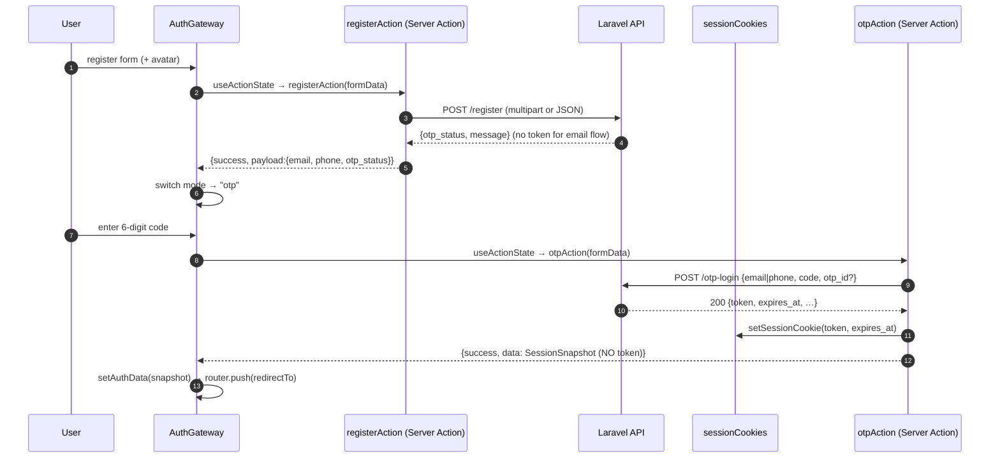

### 4.6 Social (Google) login flow (after)

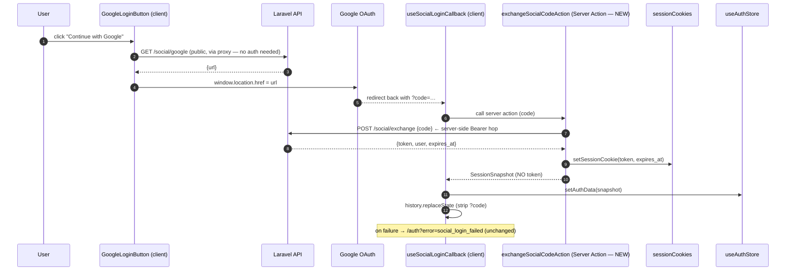

### 4.7 Session restore on refresh (after)

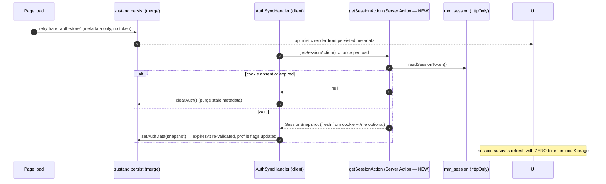

### 4.8 Logout flow (after)

```mermaid
sequenceDiagram
    autonumber
    participant UI as UserMenu / any logout trigger (client)
    participant LO as logoutAction (Server Action — NEW wrapper)
    participant API as Laravel API
    participant SC as sessionCookies
    participant ST as useAuthStore

    UI->>LO: call logoutAction()  ← replaces client authService.logout()
    LO->>API: POST /logout (Bearer via cookie bridge; best-effort)
    LO->>SC: clearSessionCookie()  ← ALWAYS (even if API call fails)
    LO-->>UI: {success}
    UI->>ST: clearAuth() → purge auth-store metadata (persist → storage event → other tabs sync)
    UI->>UI: router.replace("/")
```

### 4.9 401 / unauthorized handling (after)

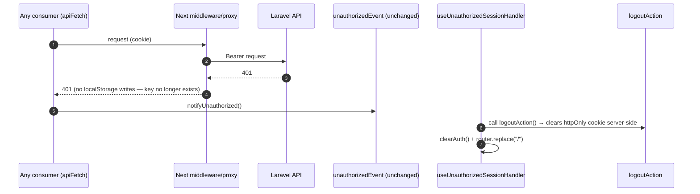

> Key change: JS cannot delete an httpOnly cookie, so the 401 handler **calls a server action** instead of `localStorage.removeItem`.

---

## 5. Detailed File-by-File Change List

### New files
| File | Contents |
|---|---|
| `src/proxy.ts` | Token bridge (Next 16 proxy convention): `mm_session` → `Authorization` for `/api/v1/:path*` |
| `src/shared/constants/sessionCookies.ts` | Cookie name constants (`mm_session`, `mm_session_hint`) |
| `src/features/auth/session/sessionCookies.ts` | `SESSION_COOKIE_NAME` re-export + `setSessionCookie`, `clearSessionCookie`, `readSessionToken` |
| `src/features/auth/actions/session.ts` | `getSessionAction()` (hydration snapshot), `logoutAction()` (clear cookie + best-effort API logout), re-exported via `actions/index.ts` |
| `src/features/auth/actions/socialExchange.ts` | Server-action wrapper for `exchangeSocialCode` |
| `src/features/auth/hooks/useSessionHydration.ts` | Mount-time hydration: calls `getSessionAction`, purges stale metadata when the cookie is gone |
| `src/features/auth/store/authStoreKeys.ts` | `auth-store` persist key constant (cross-tab storage listener) |
| `docs/auth-migration-plan.md` | This document |

### Modified files
| File | Change |
|---|---|
| `next.config.ts` | Add `rewrites()` `/api/v1/:path*` → `${API_URL}/:path*` (server env `API_URL`) |
| `src/shared/lib/api.ts` | (1) Client `BASE_URL` → same-origin `/api/v1`; keep server-side callers resolving to the real API (server `apiFetch` continues to hit `${API_URL}` directly, authenticated via `next/headers` cookie when available). (2) Delete `getAuthToken()` + `AUTH_TOKEN_STORAGE_KEY` import + localStorage removal on 401; keep `notifyUnauthorized()`. (3) Keep timeout/currency/channel logic untouched |
| `src/features/auth/store/useAuthStore.ts` | Added token-less `setSession(snapshot)`; `merge` now validates `isAuthenticated` + `expiresAt` (token no longer required → cookie users survive refresh); `logout()` delegates to `logoutAction` (server-side cookie clear); dead `login`/`register` methods deleted (D8). `token` field + `writeTokenToStorage` remain **temporarily** for the legacy OTP/social path |
| `src/features/auth/types.ts` | Add `SessionSnapshot` (user metadata + `expiresAt`, **no token**); `AuthLoginData` stays for legacy service-layer typing |
| `src/features/auth/actions/types.ts` | `ActionState.data?: AuthLoginData \| SessionSnapshot` (union during migration) |
| `src/features/auth/actions/login.ts` | Done: on success `setSessionCookie(...)`; returns snapshot; password no longer returned in `payload` (D5) |
| `src/features/auth/hooks/useAuthProfileSync.ts` | Done: gates on `isAuthenticated` instead of `token` (cookie users have no localStorage token) |
| `src/features/auth/hooks/useAuthExpirationCheck.ts` | Done: gates on `isAuthenticated`; cross-tab `storage` listener now watches both `auth_token` (legacy) and the `auth-store` persist key (cookie sessions). `?redirect=` preservation (D11) still pending |
| `src/features/auth/hooks/useSessionHydration.ts` (new) | Done: mount-time `getSessionAction()` reconcile — purges persisted metadata when the httpOnly cookie is gone |
| `src/features/auth/actions/register.ts` | Extract shared `mapApiErrorToFields()` helper (D9); unchanged success path (no token from API) |
| `src/features/auth/actions/otp.ts` | Set cookie + return snapshot on success; use shared error mapper |
| `src/features/auth/actions/forgotPassword.ts` | Use shared error mapper; delete duplicate `authService.forgetPassword` usage (D7); align validation with zod (D12) |
| `src/features/auth/actions/index.ts` | Export new session + social actions |
| `src/features/auth/services/authService.ts` | Delete `forgetPassword` duplicate (D7); keep rest |
| `src/features/auth/hooks/useSocialLoginCallback.ts` | Call `exchangeSocialCodeAction` instead of client fetch; remove unsafe `as Record<string, unknown>` spread (D6); handle typed snapshot |
| `src/features/auth/components/AuthSyncHandler.tsx` | Add `getSessionAction` hydration effect (replaces localStorage rehydration for auth state) |
| `src/features/auth/hooks/useAuthExpirationCheck.ts` | Cross-tab listener: `auth-store` key instead of `AUTH_TOKEN_STORAGE_KEY`; preserve `?redirect=` on expiry redirect (D11) |
| `src/features/auth/hooks/useUnauthorizedSessionHandler.ts` | On unauthorized: call `logoutAction` (cookie clear) then `clearAuth()` |
| `src/shared/lib/echo.ts` | `authEndpoint` → `/api/v1/broadcasting/auth` (cookie-authenticated); remove localStorage `auth_token` reads |
| `src/shared/constants/storageKeys.ts` | Remove `AUTH_TOKEN_STORAGE_KEY` (after consumers migrated) |
| `src/features/auth/index.ts` | Expand public surface: export `useAuthStore`, `useAuthModalStore`, `authService`, hooks, remaining components (D1) — then migrate 30+ deep imports (mechanical) |

### Deleted files
| File | Reason |
|---|---|
| `src/features/auth/types.ts.bak` | Dead file (D8) |

### Untouched (by design — G3)
All consumers of `apiFetch` keep working with zero edits: `features/cart`, `wishlist`, `checkout`, `coupons`, `notifications` (page/store), `profile`, `products` reviews, `location` (except `echo.ts` and `socialService`, listed above), `fast-shipping`, `site-reviews`.

---

## 6. Migration Phases (ordered so the app works after every step)

> **Execution note (2026-09-24):** All phases complete. Cookie infra (`src/proxy.ts`, Next 16) + login + register/OTP + Google social all cookie-based; no action returns a token to JS. **C1 (post-review fix):** the committed `src/proxy.ts` was the next-intl locale-routing middleware and was unintentionally replaced by the cookie bridge — locale routing (`/`, unprefixed links) broke. Fixed by unifying all three concerns in one proxy (bridge → page guards → intl middleware); no component changes needed. `src/proxy.ts` route guards: authenticated users are redirected away from `/{locale}/auth` honoring a validated `?redirect=` target (open-redirect and `/auth`-loop safe), and logged-out users are redirected from `/{locale}/profile|checkout|payment(/...)` to `/{locale}/auth?redirect=…` (unprefixed, matching the client link convention). Client-side guards (`useRequireAuth`, CheckoutForm) remain as defense-in-depth for the dead-cookie case. Race-proofing: `sessionChecked` flag + `useSessionHydration` settle auth state once per load; `useRequireAuth()` is the reusable private-page guard (ProfileTabs uses it). Review cleanups done: D7 (dead `forgetPassword`), D8 (`types.ts.bak`, dead store methods), D9 (shared `mapActionError` + zod factories localized via `getTranslations`; `auth.validation.*` / `auth.action.*` keys added to en/ar messages), D10 (OTP resend feedback), D11 (expiry/401 stay-on-page), D12 (forgot-password zod), D2 (profile-owned `ProfileSyncHandler` — auth no longer imports profile), D1 (full `features/auth/index.ts` public surface; all 34 deep imports across 10 features + app routes migrated; only `src/proxy.ts` keeps one infra-level import of the cookie-name constant). Realtime fixed by aligning the frontend Pusher app key with the backend's signing key (secret removed from frontend env). Remaining pre-push: §9 acceptance run + production build re-check. Known follow-ups: component-level i18n (OtpForm/AuthGateway inline strings), pre-existing lint errors in CheckoutForm/profile modals (unrelated to auth).

### Phase 1 — Cookie infra (no behavior change yet)
1. `next.config.ts` rewrites + server `API_URL` env var (`.env`).
2. `src/proxy.ts` token bridge (Next 16 convention).
3. `sessionCookies.ts` helpers + hint cookie.
4. **Verify:** `curl -i http://localhost:3000/api/v1/me -H "Cookie: mm_session=<token>"` (dev) → 200; without cookie → 401 passthrough shape unchanged.

### Phase 2 — Server actions write the cookie
1. Migrate `loginAction`, `otpAction` to set cookie and return `SessionSnapshot`.
2. Add `session.ts` (`getSessionAction`, `logoutAction`) + `socialExchange.ts`.
3. Keep old client store path temporarily (backward-compatible shim: if `ActionState.data.token` exists → old path; if snapshot → new path).
4. **Verify:** login sets `Set-Cookie: mm_session` (check DevTools: httpOnly, not visible to JS); token no longer appears in the action response.

### Phase 3 — Client store goes token-less
1. Rework `useAuthStore` (delete `token`/`writeTokenToStorage`/dead methods D8).
2. `AuthSyncHandler` hydration via `getSessionAction`.
3. Cross-tab listener switch; expiry-check redirect preservation (D11).
4. `useUnauthorizedSessionHandler` + logout → server action.
5. **Verify:** refresh restores session; two-tab logout syncs; expired session redirects preserving `?redirect=`.

### Phase 4 — Social login through the server
1. `useSocialLoginCallback` → `exchangeSocialCodeAction` (typed snapshot, D6).
2. **Verify:** Google flow end-to-end; failure path lands on `/auth?error=social_login_failed`.

### Phase 5 — Infra cleanup (cutover)
1. `api.ts`: delete localStorage token code; client base path → `/api/v1`.
2. `echo.ts`: proxied `authEndpoint`, no header/localStorage.
3. Remove `AUTH_TOKEN_STORAGE_KEY` from `shared/constants`.
4. **Verify:** full regression — login, register+OTP, forgot-password, Google, cart sync on login, wishlist auth-required flow, checkout, notifications realtime (Echo), profile sync, 401 recovery.

### Phase 6 — Review cleanup (from review findings)
1. Public-surface exports + deep-import migration (D1).
2. Break auth↔profile cycle (D2).
3. Shared `mapApiErrorToFields` (D9); i18n: route action messages through `messages/auth.*.json`.
4. Delete `types.ts.bak` (D8); OTP resend pending/error feedback (D10).

---

## 7. Edge Cases, Risks & Mitigations

| Risk | Mitigation |
|---|---|
| **Dev cross-origin** (`localhost:3000` → `catch.mohammedtareq.me`) | Irrelevant: requests go same-origin to the Next proxy; middleware injects Bearer server-side. No CORS/credentials involvement anymore |
| **Latency hop** (browser → Next → Laravel) | Acceptable tradeoff for XSS hardening; keep `timeout` logic; proxy adds ~1 hop only for authenticated traffic patterns that already existed client-side |
| **Proxy response caching** | Rewrites must not be cached: ensure proxied paths carry no-store semantics for authed data; currency logic already forces `cache: "no-store"` |
| **Cookie expiry vs `expiresAt`** | Cookie `Expires` = API `expires_at` (server-enforced, ~20 days). Store metadata still validated by `isSessionActive` with 15s buffer |
| **Cross-tab logout** | `clearAuth()` persists empty `auth-store` → `storage` event fires in other tabs → they re-validate and clear (listener switches from `auth_token` to `auth-store` key) |
| **Refresh hydration flicker** | Optimistic render from persisted metadata, then authoritative `getSessionAction()` reconciles (same pattern as today's profile sync, but now single-round-trip) |
| **SSR requests** | Server `apiFetch` callers (RSC/actions) currently unauthenticated → unchanged. Optional follow-up: server-side `readSessionToken()` in `apiFetch` to unlock SSR-authenticated rendering (cookie is host-wide) |
| **Rate limiting** (login 5/min, F1) | Unchanged; server actions don't change call frequency. Surface remaining-attempt messaging later |
| **Logout with dead/expired token** | `logoutAction` clears the cookie in a `finally`-style guarantee regardless of API result (mirrors current store behavior) |
| **Pusher private channels** | Echo auth moves to same-origin endpoint → cookie flows; reconnect after re-login handled by existing `NotificationRealtimeProvider` lifecycle |
| **Rollback** | Phases are additive through Phase 4 (shim keeps both paths). Cutover (Phase 5) is one commit; revert = restore `api.ts`/`echo.ts`/store from git — cookie infra remaining is harmless |

---

## 8. Follow-ups (post-migration, optional)
1. SSR-authenticated pages via server-side cookie read in `apiFetch`.
2. i18n of all action-returned messages (D9) and remaining hardcoded strings.
3. Session "remember me" flag → cookie max-age variants (needs API support).
4. CSRF token for proxied mutations if backend adds origin checks on `/api/v1` beyond current public CORS.

---

## 9. Acceptance Checklist
- [ ] Raw token is absent from ALL `localStorage`/`sessionStorage` keys (verify with DevTools after login/register/social).
- [ ] `mm_session` cookie: `httpOnly`, `secure` (prod), `sameSite=lax`, `expires` = API `expires_at`.
- [ ] Login, register+OTP, forgot-password reset, Google social — all set the cookie via server actions; responses contain no `token`/`password` fields.
- [ ] Refresh mid-session keeps the user logged in (hydration via `getSessionAction`).
- [ ] Two-tab logout sync; expiry logout preserves `?redirect=`.
- [ ] 401 triggers cookie-clearing server action + redirect (no dead state).
- [ ] Echo/Pusher realtime still authenticates (proxied endpoint).
- [ ] Cart/wishlist/checkout/coupons/notifications/flows regression passes without any consumer-file edits.
